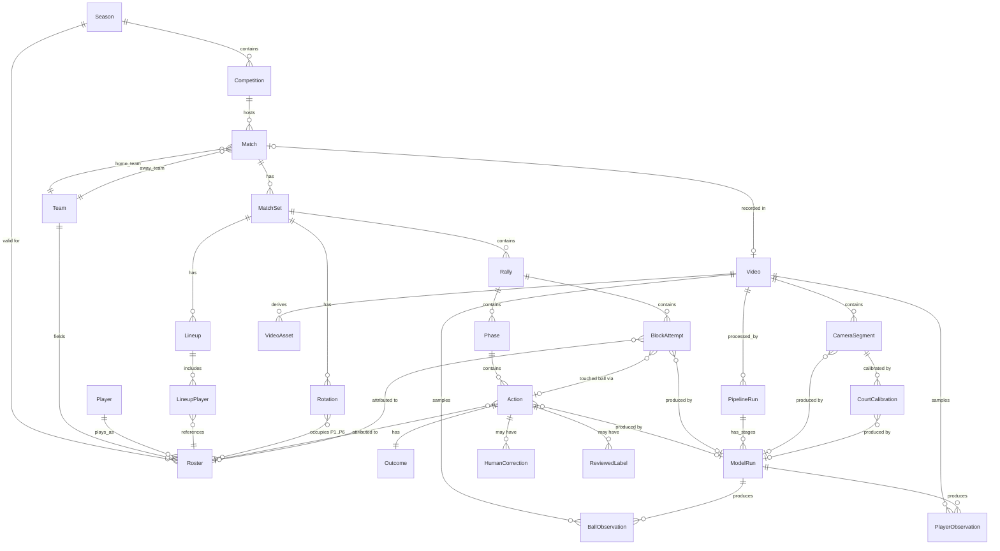

# Volleyball Domain Ontology

This is the definitive data model for match analysis, superseding Phase 1's JSON-blob synthetic result (see `TECH_DEBT.md`, now paid down) and the bare `Match`/`ProcessingJob` skeleton from ADR-002. Read `docs/architecture/DATA_FLOW.md` first — this document is that traceability model made concrete as real tables.

## Research basis

Terminology and statistics formulas below were checked against current sourced references (SDHSAA volleyball statistics guidelines, NCAA attack worksheet conventions, coachingvb.com's reception-rating documentation) rather than assumed — see citations inline where a specific number/formula could plausibly be gotten wrong (e.g. attack efficiency, reception rating scale). No proprietary scouting-software format (e.g. DataVolley's `.dvw` file format) was copied; only the underlying, standard volleyball terminology is used, which is not anyone's proprietary format.

## Universal vs. configurable

Universal (fixed by the rules of the sport, safe to hard-code): action taxonomy (serve/reception/set/attack/.../error), the 6 rotational court positions, contact-count-per-side (max 3 team touches), rally/set/match structure.

Configurable (varies by club/level/analyst convention, must not be hard-coded): reception-rating scale (commonly 0–3, but some programs use 0–4 or letter grades — see `ReceptionRatingScale` below), attack-zone numbering granularity (some programs track 6 zones, others 9), what counts as a "quality" pass threshold for sideout-efficiency reporting. These are represented as configuration inputs to the statistics engine, never baked into its formulas.

## Non-negotiable principle (see DATA_FLOW.md)

**Prediction ≠ GroundTruth ≠ HumanCorrection ≠ ReviewedLabel ≠ DerivedMetric.** None of these overwrite each other. Concretely in this schema:

- A `Prediction` is not a separate table (see "Design decision" below) — `Action`, `Outcome`, `BallObservation`, and `PlayerObservation` rows *are* predictions; each carries its own provenance (`model_run_id`) rather than a value copied into a generic wrapper.
- `HumanCorrection` is append-only: a new row per correction, holding both `previous_value` and `corrected_value`. It never updates or deletes a `Prediction` row's original values — the correction is a new fact layered on top, not a mutation. (Note: the `Action`/`Outcome`/etc. row's *current* displayed value can be updated for convenience of querying "what's the latest reviewed value," but the full correction history is independently reconstructible from `HumanCorrection` regardless of what the row currently shows — see "Correction semantics" below for the exact mechanism.)
- `ReviewedLabel` records human sign-off (confirmed / corrected / rejected) — distinct from `HumanCorrection` because a human can review and *confirm* a prediction without changing it; not every review is a correction.
- `DerivedMetric` (statistics) is **never persisted as a mutable number.** It is always computed on demand by the pure statistics engine (`volley_domain.stats`) from the `Action`/`Outcome`/`Rally` rows, tagged with a `formula_version`. If a cache is ever added for performance, the cache row must carry the exact `formula_version` + input snapshot hash used to produce it (not built in Phase 2 — no caching need yet, this is the constraint a future cache must satisfy).

## Design decisions worth flagging explicitly (for architecture-lead review)

1. **No generic `Prediction` table.** A fully polymorphic `Prediction(target_type, target_id, value_json, ...)` table was considered and rejected: it would require every consumer to interpret an untyped JSON blob, duplicate columns that already belong on `Action`/`BallObservation`/`PlayerObservation` (confidence, model_run_id), and adds a layer of indirection with no query benefit — nothing needs to list "all predictions of any kind" as a single homogeneous set. Per CLAUDE.md's "no abstracciones antes de que se necesiten," the typed tables satisfy the same requirement (full provenance, never destroyed, distinguishable from corrections) more simply. Revisit if a real cross-entity "list all unreviewed predictions" feature needs a unified query surface that typed tables can't serve efficiently (a UNION query across 4 tables is the first thing to try before reaching for a generic table).
2. **`CourtPosition` is a value type, not a table.** Normalized `(x, y)` court coordinates appear on `Action`, `BallObservation`, and `PlayerObservation` as plain columns, not a foreign key to a shared `CourtPosition` row — a coordinate pair has no identity or lifecycle of its own worth tracking separately. ~~The *court calibration* that makes those coordinates meaningful (homography, confidence, auto vs. manual) will get its own table in Phase 5 (`ml/court`) when calibration is actually implemented; it doesn't exist yet because nothing produces it yet, per "no dejar TODOs silenciosos" — this is a deliberately deferred table, not a forgotten one.~~ **Added 2026-08-31** (migration `0006`, in direct response to an external annotation-spec review naming this exact gap): `CameraSegment` + `CourtCalibration`, see "Camera & court calibration" below. The keypoints used to compute a calibration are themselves kept as a JSON value on the `CourtCalibration` row, not a separate table — same "value type, not a table" reasoning, since they're only ever read/written together with the calibration they produced.
3. **`Organization` is not our table.** Better Auth owns it (ADR-001/ADR-002). Every org-scoped entity below (`Team`, `Competition`, `Season`, `Video`, ...) stores a plain `organization_id` string column, exactly like `Match` already does — no FK, per CLAUDE.md's auth-ownership rule.
4. **`ProcessingJob` (Phase 1) and `PipelineRun`/`ModelRun` (this ontology) are different, deliberately.** `ProcessingJob` is job-progress-for-a-UI (status/progress/stage, polled by the frontend). `PipelineRun`/`ModelRun` are the domain-level *record of what actually ran* (model version, weights hash, dataset version — the provenance fields CLAUDE.md requires on every prediction). A `ProcessingJob` can reference the `PipelineRun` it's tracking progress for (nullable FK, added now for forward compatibility even though Phase 2's synthetic generator is the only thing populating it so far).

## Entities

### Roster / competition structure

- **Competition** — a named competition within a `Season` (e.g. "Liga A 2026"), org-scoped.
- **Season** — a named time span (e.g. "2025–2026"), org-scoped.
- **Team** — org-scoped; a club/team entity, independent of any specific competition.
- **Player** — a person; can appear on multiple `Roster` rows over time (different teams/seasons).
- **Roster** — the association of a `Player` to a `Team` for a `Season`, with jersey number and primary position (`OH`/`OP`/`MB`/`S`/`L`). This is what `Lineup`/`Rotation`/`Action.actor_roster_id` actually reference — never `Player` directly — because jersey number and position are season-specific, not permanent facts about a person.

### Match structure

- **Match** (extends the Phase 1 table) — now optionally links `competition_id`, `season_id`, `home_team_id`/`away_team_id` (real `Team` refs). The Phase 1 free-text `home_team`/`away_team` columns remain as a display fallback for matches created before real `Team` records exist (a coach uploading a video shouldn't be blocked on first creating formal team records) — nullable, not removed.
- **MatchSet** ("Set" — renamed to avoid shadowing Python's `set` builtin at the class-name level) — one set within a match; final score, winner.
- **Lineup** — the set of `Roster` entries a team is drawing from for a given `MatchSet` (via `LineupPlayer`), independent of court arrangement.
- **LineupPlayer** — one `Roster` entry's participation in a `Lineup` (starting vs. bench, libero flag for this set).
- **Rotation** — a snapshot of which `Roster` entry occupies each of the 6 court positions, valid from a given `Rally` onward until the next `Rotation` row for that team+set (i.e., changes on every sideout).

### Rally structure

- **Rally** — one continuous live-ball sequence within a `MatchSet`; serving team, point winner, video timing.
- **Phase** — a possession segment within a `Rally` (e.g. "reception," "transition 1") — groups `Action`s by which team currently has the ball, per ADR-001's `video → set → rally → phase → action → outcome` hierarchy. `PhaseType.RECEPTION` corresponds to what analysts formally call **Complex I** (serve-receive → attack); `PhaseType.TRANSITION` corresponds to **Complex II** (any subsequent dig/free-ball → attack). The schema uses the plainer `RECEPTION`/`TRANSITION` labels rather than "Complex I/II" — noted here explicitly (per independent domain review) so the mapping is unambiguous to anyone with formal coaching terminology reading exported phase data, even though the schema itself doesn't use that vocabulary.
- **Action** — a single volleyball action (serve/reception/set/attack/tip/block/dig/free_ball/transition), attributed to a `Roster` entry (nullable — attribution can fail/be unknown), with court coordinates, timing, confidence, and `model_run_id` provenance.
- **Outcome** — 1:1 with `Action`; the result (`continue`/`point`/`error`) plus optional detail (e.g. which specific error type).
- **BlockAttempt** (added 2026-08-31) — a blocker's tactical participation in a block *whether or not they touched the ball*, deliberately separate from `Action(action_type=block)`. FIVB-style `block_mode` (`read`/`commit`/`swing`/`unknown`), `block_role` (`solo`/`left`/`middle`/`right`/`assist`/`unknown`), `jumped`. When the blocker also touched the ball, both rows exist for the same event, linked via `BlockAttempt.action_id`. Without this table, a committed blocker who never touches the ball is unrepresentable at all — roughly half of real defensive block information. See `PROFESSIONAL_ANNOTATION_PROTOCOL.md`'s "Block participation" section.

### Camera & court calibration

- **CameraSegment** (added 2026-08-31) — a contiguous span of one `Video` where a single camera framing holds; a broadcast cut/pan/zoom starts a new segment, since one homography is only valid within one framing. `shot_type` (`main_wide`/`endline_wide`/`side_wide`/`closeup`/`replay`/`scoreboard`/`other`) and `tactical_usable` (`usable`/`not_usable`/`partial`) — replays/close-ups are `not_usable` so they can never silently enter real-match statistics.
- **CourtCalibration** (added 2026-08-31) — the production-side mirror of `volley_domain.annotation.CameraCalibrationAnnotation` (the ground-truth calibration schema, deliberately kept field-compatible rather than a separate vocabulary — see that class's own docstring). `image_width`/`image_height`, one homography (3x3 matrix, JSON), the named keypoints used to compute it (JSON — see design decision 2 above; same field names/polarity as `CourtKeypointAnnotation`), `method` (`automatic`/`manual`/`hybrid`, matching `calibration_mode` and CLAUDE.md's own Court decision wording), `confidence`, `reprojection_error_px`, and the optional Phase-B metric-3D fields (`camera_matrix`/`rotation_world_to_camera`/`translation_world_to_camera_m`/`supports_metric_3d`). A segment may accumulate more than one calibration over time; superseded rows are kept, never deleted, marked via `superseded_at` (not sorted by `created_at` — two calibrations in one transaction share an identical Postgres `now()`).

### Video & pipeline provenance

- **Video** — the source video record: hash, duration, fps, codec, upload metadata. Optionally linked to a `Match`.
- **VideoAsset** — derived artifacts (proxy, rally clips) referencing the original `Video`.
- **PipelineRun** — one execution of the analysis pipeline against a `Video`: `pipeline_version`, `config_hash`, status, timing.
- **ModelRun** — one stage of a `PipelineRun` (ingest/court_calibration/detection/tracking/pose/ball_trajectory/contact_detection/action_recognition/biomechanics/synthetic): `model_version`, `weights_hash`, `dataset_version`. Every `Action`/`Outcome`/`BallObservation`/`PlayerObservation`/`CameraSegment`/`CourtCalibration`/`BlockAttempt` links to the `ModelRun` that produced it — this is the chain that answers "why does the product show me this." `ingest` (added Phase 4, 2026-08-30) is the odd one out: it records which ffmpeg build produced a `Video`'s `fps`/`width`/`height`/`codec`, not a trained model's output, but the same provenance shape applies (`model_version` holds the ffprobe version string, `config_hash` fingerprints the ffmpeg build's own configuration).

### Raw observations

- **BallObservation** — one ball position sample: video timestamp, court `(x, y, z)`, `observed`/`interpolated`/`predicted` provenance, confidence.
- **PlayerObservation** — one player tracking sample: video timestamp, court `(x, y)`, optional `Roster` attribution, track id, confidence.

### Human review

- **HumanCorrection** — append-only; `target_type` + `target_id` (polymorphic reference to any correctable row), `previous_value`, `corrected_value`, corrected-by user, timestamp, optional reason. See "Correction semantics" below for exactly how this interacts with the target row.
- **ReviewedLabel** — a human's review verdict (`confirmed`/`corrected`/`rejected`) on a target row — distinct from `HumanCorrection` because confirming a prediction as correct is a review with no correction.

## Correction semantics (append-only, never destroys the prediction)

1. A `HumanCorrection` row is inserted: `target_type="action"`, `target_id=<action.id>`, `field_name="action_type"`, `previous_value={"action_type": "attack"}`, `corrected_value={"action_type": "tip"}`, `corrected_by_user_id`, `corrected_at`.
2. The `Action` row's own `action_type` column *may* be updated to the corrected value (so ordinary reads reflect the correction without needing to replay the correction log) — **but the original model-produced value is never lost**, because it's preserved in the `HumanCorrection.previous_value` of that row, and the `Action` row's `model_run_id`/`confidence` (which describe the *original* prediction) are never touched by a correction.
3. A `ReviewedLabel` row is inserted alongside: `status="corrected"`.
4. Reconstructing "what did the model originally say" for any `Action` is always possible: read the `Action`'s `model_run_id`/`confidence` (untouched) plus the oldest `HumanCorrection` row for that `target_id` (its `previous_value`).

This is deliberately not a fully event-sourced/immutable-row design (which would mean `Action` itself never changes and every read replays corrections) — that was considered and rejected for Phase 2 as more machinery than the current query patterns justify. Revisit if/when corrections need to be reverted or replayed, which the current design doesn't support cleanly.

## Statistics engine (`volley_domain.stats`)

Pure, testable functions: `list[Rally] + list[Action] + list[Outcome] + config -> DerivedMetric` shapes. Never queries the database directly (keeps it unit-testable without Postgres) and never computes anything the Event Log can't already answer. See `packages/domain-py/src/volley_domain/stats/engine.py` for the implementation and `packages/domain-py/tests/test_stats_engine.py` for known-input/known-output test cases per statistic.

Covered: serves, aces, serve errors, serve zones; receptions, reception ratings (configurable scale — see `ReceptionRatingScale`); attacks, kills, attack errors, blocked attacks, attack efficiency (`(kills - errors) / total_attempts`, verified against SDHSAA/NCAA convention — see sources above); blocks; digs; sideout % (points won on reception / total reception rallies); breakpoint % (points won on serve / total serve rallies); rotation-level breakdowns; setter distribution; attack zones/directions; rally duration.

## Coordinate system (`volley_domain.court`)

Normalized `[0, 1] × [0, 1]` per team's own attacking half, exactly as established in Phase 1's synthetic generator (`_mirror_for_away`) — now formalized as `volley_domain.court` with documented zone numbering (1–6, standard volleyball rotational numbering) and a tested `mirror_for_away(x, y)` function, so both teams' actions can be compared/overlaid in one consistent frame regardless of which side of the net they're playing on. See `packages/domain-py/tests/test_court.py` for geometric invariant tests (mirroring is its own inverse, zone anchors round-trip, coordinates stay in bounds).

## Lineage: answering "why does it show me 43%?"

`volley_domain.lineage` provides `explain_metric(...)` returning the exact chain: `DerivedMetric value → the Action/Outcome rows it was computed from → their Rally rows → their video-clip references`. See `packages/domain-py/tests/test_lineage.py`. This is a read-only query helper, not a new persisted entity — the traceability already exists structurally (every `Action` has a `rally_id`; every `Rally` has a `set_id`/`match_id`; every `Video` is the root), `explain_metric` just walks it in the direction a coach's question goes.

## ER diagram

## JSON examples

See `docs/domain/examples/` for representative serialized objects (an `Action`, a `Rally` with nested `Phase`/`Action`/`Outcome`, a `HumanCorrection`, and a `DerivedMetric` response with its lineage chain).

Sources: [SDHSAA volleyball statistics guidelines](https://sdhsaa.com/volleyball-stats/), [WIAA NCAA attack worksheet](https://www.wvcweb.org/pdf/ncaa_volleyball_statistics.pdf), [coachingvb.com reception rating](https://coachingvb.com/scoring-serving-and-passing-effectiveness/).
